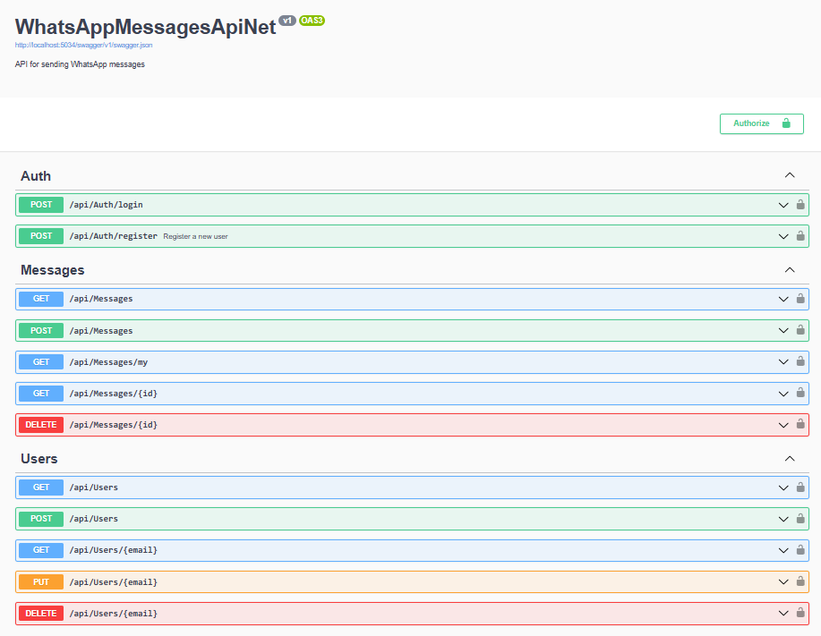
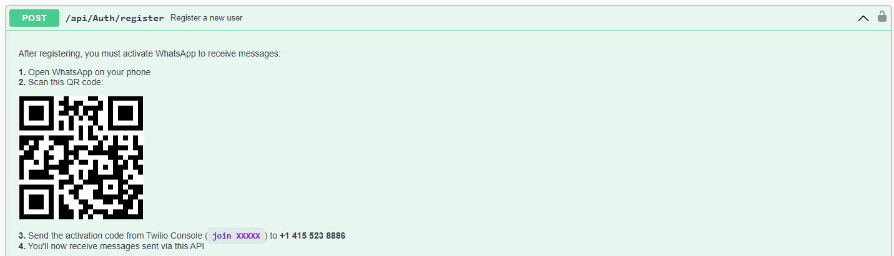

# WhatsAppMessagesApiNet

A Clean Architecture .NET 8 API for sending WhatsApp messages through configurable Business Service Provider (BSPs) — Twilio.

## Key Features

- **Multi-Database**: SQL Server (default), MySQL, PostgreSQL, SQLite, or MongoDB — switchable in `appsettings.json`
- **JWT Authentication**: Three roles — Admin, Operator, Viewer
- **Email-to-Phone Resolution**: Sending to an email auto-resolves to the recipient's phone number
- **Self-Registration**: Users can register and receive their own messages
- **Audit Trail**: Automatic change logging via EF Core interceptor
- **Swagger UI**: Interactive API documentation with JWT auth support
- **Clean Architecture**: Domain, Application, Infrastructure, API — strict dependency direction

## Technology Stack

| Category | Technology |
|---|---|
| **Runtime** | .NET 8.0 / C# 12 |
| **Architecture** | Clean Architecture (4-layer) |
| **ORM** | Entity Framework Core 8.0 (relational) / MongoDB.Driver (NoSQL) |
| **Auth** | ASP.NET Core JWT Bearer + BCrypt |
| **Mapping** | AutoMapper 13 |
| **Validation** | FluentValidation 11 |
| **Logging** | Serilog (Console + Rolling File) |
| **API Docs** | Swashbuckle 6 + Annotations |
| **Testing** | xUnit + Moq + FluentAssertions + Microsoft.AspNetCore.Mvc.Testing |

## Project Structure

```
WhatsAppMessagesApiNet.Domain/           # Entities, Enums, Interfaces (contracts)
WhatsAppMessagesApiNet.Application/      # DTOs, Services, Validators, AutoMapper profiles
WhatsAppMessagesApiNet.Infrastructure/   # Persistence (EF/Mongo), Repositories, Providers, Auth, Audit
WhatsAppMessagesApiNet.Api/              # Controllers, Middleware, Configuration, Startup
WhatsAppMessagesApiNet.UnitTests/        # 16 unit tests (Services, Controllers, Validators)
WhatsAppMessagesApiNet.IntegrationTests/ # 5 integration tests (Auth, Messages)
```

## Database

Supports 5 providers configured via `DatabaseProvider` in `appsettings.json`:

| Provider | Connection String Key |
|---|---|
| `SqlServer` (default) | `ConnectionStrings:SqlServer` |
| `MySql` | `ConnectionStrings:MySql` |
| `PostgreSql` | `ConnectionStrings:PostgreSql` |
| `Sqlite` | `ConnectionStrings:Sqlite` |
| `MongoDB` | `ConnectionStrings:MongoDb` + `MongoDbSettings:DatabaseName` |

- **Development**: `EnsureCreated()` auto-creates the schema
- **Production**: `context.Database.Migrate()` uses EF migrations
- **Seeding**: Creates admin user `luis@mail.com` / `123456` on first run

## Authentication

JWT tokens embed email, name, and role claims.

| Role | Permissions |
|---|---|
| **Admin** | Full access — manage users, send messages, view all messages |
| **Operator** | Default for self-registered users — view own messages |
| **Viewer** | Reserved for future use |

## API Endpoints

### Auth (`/api/auth`) — Public
| Method | Route | Description |
|---|---|---|
| POST | `/api/auth/login` | Authenticate and receive JWT |
| POST | `/api/auth/register` | Create account + auto-login |

### Messages (`/api/messages`) — Authenticated
| Method | Route | Roles | Description |
|---|---|---|---|
| GET | `/api/messages` | Admin | List all messages (paginated) |
| GET | `/api/messages/my` | Any | Messages sent to the logged-in user |
| GET | `/api/messages/{id}` | Owner/Admin | Get message by ID |
| POST | `/api/messages` | Admin | Create and send a WhatsApp message |
| DELETE | `/api/messages/{id}` | Admin | Delete a message |

### Users (`/api/users`) — Admin only
| Method | Route | Description |
|---|---|---|
| GET | `/api/users` | List all users (paginated) |
| GET | `/api/users/{email}` | Get user by email |
| POST | `/api/users` | Create a new user |
| PUT | `/api/users/{email}` | Update user |
| DELETE | `/api/users/{email}` | Delete user |

## WhatsApp Provider

Configured via `WhatsAppProviders:Default` in `appsettings.json`:

| Provider | Config Section | Description |
|---|---|---|
| `Twilio` | `WhatsAppProviders:Twilio` | Sends via Twilio Messages API |

### Sending Flow

1. Admin creates message via `POST /api/messages`
2. If `to` is an email, resolves to recipient's phone number from Users table
3. Message saved as `Pending`
4. First configured provider sends the message
5. Status updated to `Sent` or `Failed`

## Getting Started

### Prerequisites

- .NET 8 SDK
- SQL Server (or your preferred DB from the supported list)
- Twilio account for WhatsApp sending

### Configuration

1. Clone the repository
2. Update `appsettings.Development.json`:
   - Set your `DatabaseProvider` and `ConnectionStrings`
   - Configure `WhatsAppProviders` with your credentials
   - Adjust `JwtSettings:SecretKey` (min 32 characters)
3. Run the application

### Running

```bash
cd WhatsAppMessagesApiNet.Api
dotnet run
```

Swagger UI opens at `http://localhost:5034/swagger`.

### Testing

```bash
dotnet test
```

16 unit tests + 5 integration tests.

## Screenshots




[DeepWiki moraisLuismNet/WhatsAppMessagesApiNet](https://deepwiki.com/moraisLuismNet/WhatsAppMessagesApiNet)
